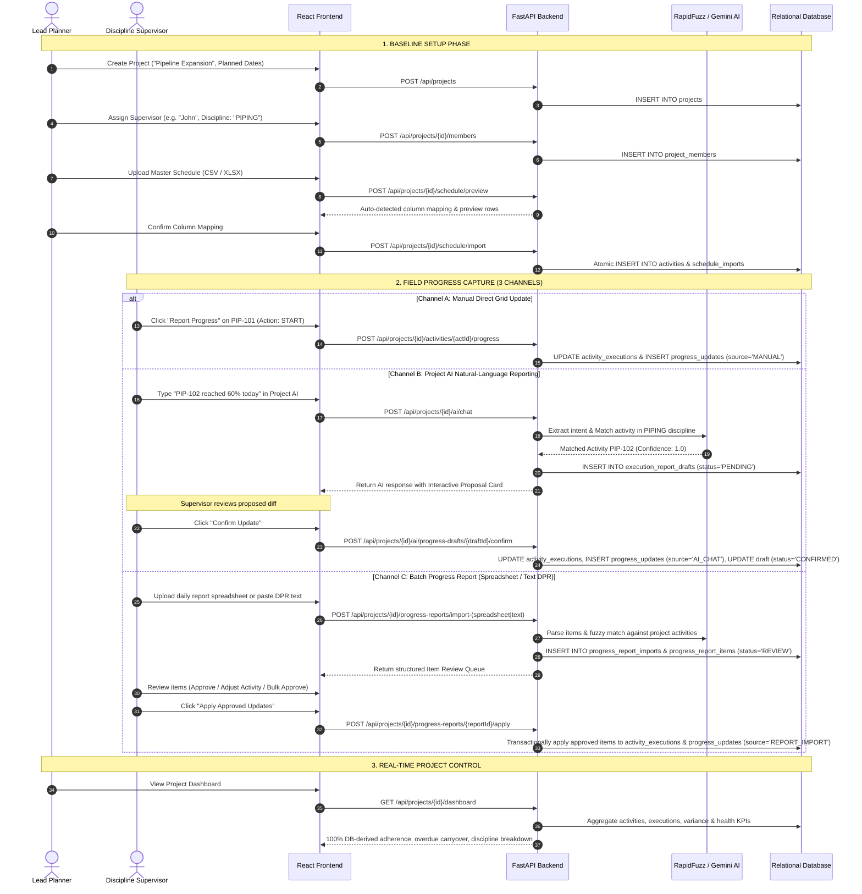
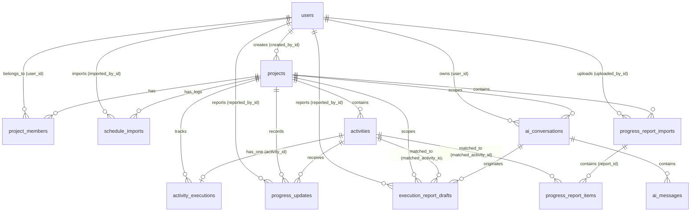

# PROJECT_CONTEXT.md — SIH26122 System Architecture & Handoff Context

> **Last Updated:** September 10, 2026  
> **Repository:** SIH26122 — Intelligent Data Capture & Schedule-Linking Layer for Infrastructure Project Management  
> **Status:** Production-Ready Demo / Active Feature Development (Phases 1–10 Complete)

---

## Table of Contents

1. [Executive Summary & System Vision](#1-executive-summary--system-vision)
2. [High-Level Architecture & Tech Stack](#2-high-level-architecture--tech-stack)
3. [System Data Flow & Operational Lifecycle](#3-system-data-flow--operational-lifecycle)
4. [Backend Architecture & Module Breakdown](#4-backend-architecture--module-breakdown)
5. [Frontend Architecture & Component Breakdown](#5-frontend-architecture--component-breakdown)
6. [Complete Database Structure & Entity Relationships](#6-complete-database-structure--entity-relationships)
7. [Comprehensive API Catalog](#7-comprehensive-api-catalog)
8. [Implemented Feature Capabilities (Phases 1–9)](#8-implemented-feature-capabilities-phases-19)
9. [Important Architectural & Design Decisions](#9-important-architectural--design-decisions)
10. [Known Issues, Quirks & Technical Boundaries](#10-known-issues-quirks--technical-boundaries)
11. [Current Work in Progress (Phase 10: Planner Review Center)](#11-current-work-in-progress-phase-10-planner-review-center)
12. [Exact Next Steps & Implementation Roadmap](#12-exact-next-steps--implementation-roadmap)

---

## 1. Executive Summary & System Vision

### Problem Statement
In large-scale infrastructure construction (hydrocarbon refineries, metro transit, highways, process plants), there is a massive disconnect between:
1. **Master Baseline Schedules** (e.g. Primavera P6, Microsoft Project) maintained at L3–L6 detail by Lead Planners.
2. **Ground-Level Field Updates** submitted daily by site Discipline Supervisors via unstructured notes, chat messages, Daily Progress Reports (DPRs), and spreadsheets.

This disconnect causes schedule latency, data loss, delayed critical path identification, and manual data-entry overhead.

### SIH26122 Solution
**SIH26122** serves as the intelligent data-capture and schedule-linking middleware layer:
- Ingests complex baseline schedules (CSV/XLSX) with automatic column mapping and validation.
- Enables multi-channel progress ingestion:
  - **Direct Manual Field Reporting** with strict state machine validation.
  - **Natural-Language AI Chat Reporting** (Google Gemini 2.5 Flash + RapidFuzz fuzzy matching + Human Confirmation Workflow).
  - **Batch Progress Report Ingestion** (Spreadsheets & pasted free-text DPRs parsed into structured line-item reviews).
- Enforces strict Role-Based Access Control (RBAC) segregated by engineering disciplines (`CIVIL`, `PIPING`, `ELECTRICAL`, `MECHANICAL`, `INSTRUMENTATION`, `HSE`).
- Guarantees **Zero Silent AI Updates**: Every AI extraction generates an explicit proposal card requiring human Supervisor confirmation before writing to the database.
- Maintains an append-only audit trail (`ProgressUpdate`) protecting original planned baseline dates while computing real-time variance, delay metrics, and 100% database-derived project dashboards.

---

## 2. High-Level Architecture & Tech Stack

```
+----------------------------------------------------------------------------------------------------+
|                                      CLIENT LAYER (Browser)                                        |
|  +-----------------------------------------------------------------------------------------------+ |
|  | React 18 + Vite SPA | React Router v6 | Lucide React Icons | Vanilla Industrial CSS Tokens    | |
|  | - Auth Context & JWT Storage                                                                  | |
|  | - Planner Workspace (My Projects, Create Project, Schedule Import, Team Allocation)            | |
|  | - Supervisor Workspace (Assigned Projects, Discipline Operations)                             | |
|  | - Shared Project Workspace:                                                                   | |
|  |    * Dashboard Tab (100% DB-Derived KPIs, S-Curve adherence, Today's Work, Overdue List)      | |
|  |    * Schedule Baseline Tab (Paginated L5/L6 Grid, Filters, Activity Detail Drawer)            | |
|  |    * Project AI Tab (Operational Assistant, Tool-Use Queries, Interactive Proposal Cards)     | |
|  |    * Progress Reports Tab (Spreadsheet & Text DPR Ingestion, Item Review & Batch Apply)       | |
|  |    * Team Tab (Discipline assignments, Supervisor management)                                 | |
|  +-----------------------------------------------------------------------------------------------+ |
+-------------------------------------------------+--------------------------------------------------+
                                                  | HTTPS / JSON REST API
                                                  v
+----------------------------------------------------------------------------------------------------+
|                                    BACKEND APPLICATION LAYER                                       |
|  FastAPI 0.115+ (Python 3.11+) | Uvicorn ASGI | Pydantic v2 Validation | Passlib Bcrypt | PyJWT    |
|  +-----------------------------------------------------------------------------------------------+ |
|  | Routers:                                                                                      | |
|  | - /api/auth              - User registration, login, profile (/me)                            | |
|  | - /api/projects          - Project baseline CRUD, team assignments, discipline binding        | |
|  | - /api/projects/schedule - Schedule upload preview, atomic import, filtered activity query    | |
|  | - /api/projects/execution- Progress report transitions (START, PROGRESS, COMPLETE, etc.)      | |
|  | - /api/projects/dashboard- 100% database-derived live dashboard aggregation                   | |
|  | - /api/projects/ai       - Project AI Assistant, conversation history, natural draft workflow | |
|  | - /api/projects/progress-reports - Spreadsheet/DPR batch parser, review queue, batch apply    | |
|  | - /api/users             - Supervisor lookup directory                                        | |
|  +-----------------------------------------------------------------------------------------------+ |
|  | Services & Logic Layer:                                                                       | |
|  | - schedule_service.py     : Column alias auto-detector, date normalizer, atomic bulk importer | |
|  | - execution_service.py    : Finite state machine, discipline RBAC guard, variance calculation  | |
|  | - dashboard_service.py    : Real-time adherence, health, overdue, and upcoming deadline metrics| |
|  | - activity_matching_service: RapidFuzz code + name matching + transition bonus scoring        | |
|  | - batch_report_service.py : Spreadsheet & DPR parsing, item transition validator, serializers | |
|  | - ai/gemini_provider.py    : Gemini 2.5 Flash SDK orchestration with 10 safe read-only tools   | |
|  | - ai/report_extractor.py  : Structured JSON intent extraction with regex fallback & normalizer| |
|  | - ai/tools.py             : 10 Server-bound DB read tools (bounded to project_id & user scope) | |
+-------------------------------------------------+--------------------------------------------------+
                                                  | SQLAlchemy 2.0 ORM
                                                  v
+----------------------------------------------------------------------------------------------------+
|                                      DATA PERSISTENCE LAYER                                        |
|  SQLite (Local Dev: sih26122.db) / PostgreSQL Compatible                                           |
|  +-----------------------------------------------------------------------------------------------+ |
|  | 11 Relational Tables:                                                                          | |
|  |  users, projects, project_members, activities, schedule_imports, activity_executions,         | |
|  |  progress_updates, ai_conversations, ai_messages, execution_report_drafts,                    | |
|  |  progress_report_imports, progress_report_items                                               | |
+----------------------------------------------------------------------------------------------------+
```

### Technology Matrix

| Component | Technology | Version / Specification | Purpose |
|---|---|---|---|
| **Frontend Framework** | React | `^18.3.1` | Component-driven Single Page Application |
| **Build Tooling** | Vite | `^5.4.0` | Ultra-fast HMR and build pipeline |
| **Client Routing** | React Router DOM | `^6.26.0` | Declarative client-side routing & route guards |
| **Icons** | Lucide React | `^0.441.0` | Modern SVG iconography |
| **Styling** | Vanilla CSS | Custom Design System | High-contrast industrial design tokens, responsive CSS grids |
| **Backend Framework**| FastAPI | `^0.115.0` | Asynchronous RESTful API framework |
| **ASGI Server** | Uvicorn | `^0.30.0` | High-performance ASGI production server |
| **ORM & DB Engine** | SQLAlchemy | `^2.0.35` | Object-Relational Mapping & query composition |
| **Validation Layer** | Pydantic | `^2.9.0` | Request/Response schema validation & serialization |
| **Data Processing** | Pandas / OpenPyXL | `^2.2.2` / `^3.1.5` | Spreadsheet ingestion, column parsing, date normalization |
| **Fuzzy Matching** | RapidFuzz | `^3.9.0` | Levenshtein & token ratio fuzzy text matching |
| **AI LLM SDK** | `google-genai` | `^0.2.2` | Native Google Gemini 2.5 Flash SDK |
| **Password Security**| Passlib (Bcrypt) | `^1.7.4` | Salted SHA-256 / Bcrypt password hashing |
| **Token Auth** | PyJWT | `^2.9.0` | Signed HMAC-SHA256 JWT access tokens |

---

## 3. System Data Flow & Operational Lifecycle



---

## 4. Backend Architecture & Module Breakdown

The backend follows clean layered separation under `backend/app/`:

```text
backend/app/
├── ai/
│   ├── __init__.py
│   ├── gemini_provider.py         # Google Gemini 2.5 Flash SDK integration & tool-call loop
│   ├── prompts.py                 # Structured system instructions & role contexts
│   ├── report_extractor.py        # Structured JSON extraction with regex fallback & normalizer
│   └── tools.py                   # 10 Server-bound safe read-only database query tools
├── core/
│   ├── activity_code_utils.py     # Deterministic activity code cleaner & extractor
│   ├── config.py                  # Settings loaded from environment variables (.env)
│   ├── datetime_utils.py          # Timezone-aware date calculations & helpers
│   ├── dependencies.py            # FastAPI auth & RBAC dependencies (require_planner, etc.)
│   └── security.py                # Password hashing & JWT token encoding/decoding
├── database/
│   └── database.py                # SQLAlchemy engine, declarative Base, session dependency
├── models/
│   ├── __init__.py                # Model registry
│   ├── user.py                    # User ORM model
│   ├── project.py                 # Project ORM model
│   ├── project_member.py          # ProjectMember ORM model
│   ├── activity.py                # Activity ORM model (L5/L6 baseline)
│   ├── schedule_import.py         # ScheduleImport audit ORM model
│   ├── activity_execution.py      # ActivityExecution actual state model
│   ├── progress_update.py         # ProgressUpdate append-only audit model
│   ├── ai_chat.py                 # AIConversation & AIMessage models
│   ├── execution_report_draft.py  # ExecutionReportDraft model (Phase 8)
│   ├── progress_report_import.py  # ProgressReportImport model (Phase 9)
│   └── progress_report_item.py    # ProgressReportItem model (Phase 9)
├── routers/
│   ├── auth.py                    # /api/auth (register, login, me)
│   ├── projects.py                # /api/projects (CRUD, members, disciplines)
│   ├── schedule.py                # /api/projects/{id}/schedule & activities
│   ├── execution.py               # /api/projects/{id}/activities/{id}/progress & execution
│   ├── dashboard.py               # /api/projects/{id}/dashboard
│   ├── ai_chat.py                 # /api/projects/{id}/ai/chat, conversations, drafts
│   ├── progress_reports.py        # /api/projects/{id}/progress-reports (Phase 9 batch ingestion)
│   ├── users.py                   # /api/users/supervisors
│   └── test_roles.py              # /api/test/planner & /api/test/supervisor
├── schemas/
│   ├── user.py                    # Pydantic user request/response schemas
│   ├── project.py                 # Pydantic project & membership schemas
│   ├── activity.py                # Pydantic activity & schedule import schemas
│   ├── execution.py               # Pydantic progress report & execution summary schemas
│   ├── dashboard.py               # Pydantic project control dashboard schemas
│   ├── ai_chat.py                 # Pydantic AI conversation & draft proposal schemas
│   └── progress_report.py         # Pydantic batch report import & item review schemas
├── services/
│   ├── project_service.py         # Project ownership & authorization verification
│   ├── schedule_service.py        # CSV/XLSX schedule parsing, validation & atomic import
│   ├── execution_service.py       # State machine validation, RBAC guard, progress application
│   ├── dashboard_service.py       # 100% DB-derived project KPI calculations & aggregations
│   ├── activity_matching_service.py # RapidFuzz multi-factor candidate activity matcher
│   └── batch_report_service.py    # Batch report file parsing, item transition validator, formatters
└── main.py                        # FastAPI application entry point, CORS, table initialization
```

---

## 5. Frontend Architecture & Component Breakdown

The frontend is a modern React SPA located in `frontend/src/`:

```text
frontend/src/
├── components/
│   ├── Navbar.jsx                 # Global authenticated topbar (Brand, Role badge, User email, Logout)
│   ├── ProtectedRoute.jsx         # Role-based route guard redirecting unauthorized callers
│   ├── DashboardTab.jsx           # Real-time project control dashboard with visual metrics & progress bars
│   ├── ProjectAITab.jsx           # AI Assistant chat interface, conversation sidebar, interactive draft cards
│   └── VoiceInputButton.jsx       # Browser microphone speech recognition button (Web Speech API)
├── context/
│   └── AuthContext.jsx            # React Context managing token, user profile, login/logout, auto-hydrate
├── pages/
│   ├── LoginPage.jsx              # Sign-in page with demo credentials helper
│   ├── RegisterPage.jsx           # User registration with role selector (PLANNER / SUPERVISOR)
│   ├── PlannerWorkspace.jsx       # Planner portal showing "My Managed Projects" & quick actions
│   ├── CreateProjectPage.jsx      # Form for initializing a new infrastructure project baseline
│   ├── SupervisorWorkspace.jsx    # Supervisor portal showing "My Assigned Projects" & disciplines
│   ├── ProjectWorkspace.jsx       # Master project hub housing Dashboard, Schedule, AI, Reports, Team tabs
│   └── ProgressReportsPage.jsx    # Batch report ingestion hub (Spreadsheet upload, Text DPR, Review Queue)
├── services/
│   └── api.js                     # Centralized Fetch client with JWT authorization headers
├── App.jsx                        # Main React routing tree and root dynamic redirect logic
├── index.css                      # Complete Industrial Light/Dark styling system (~95 KB)
└── main.jsx                       # React DOM root mounting script
```

---

## 6. Complete Database Structure & Entity Relationships

### Relational Entity-Relationship Diagram



### Table Definitions & Column Specifications

#### 1. `users`
Represents registered system users with role segregation.
- `id` (Integer, Primary Key, Auto-increment)
- `full_name` (String(255), Not Null)
- `email` (String(255), Unique, Indexed, Not Null)
- `hashed_password` (String(255), Not Null)
- `role` (String(50), Not Null) — `'PLANNER'`, `'SUPERVISOR'`
- `is_active` (Boolean, Default: True, Not Null)
- `created_at` (DateTime, UTC, Not Null)

#### 2. `projects`
Represents infrastructure project baselines.
- `id` (Integer, Primary Key, Auto-increment)
- `name` (String(255), Not Null)
- `project_code` (String(100), Unique, Indexed, Not Null)
- `description` (Text, Nullable)
- `location` (String(255), Nullable)
- `planned_start_date` (Date, Not Null)
- `planned_end_date` (Date, Not Null)
- `status` (String(50), Default: `'PLANNING'`, Not Null) — `'PLANNING'`, `'ACTIVE'`, `'ON_HOLD'`, `'COMPLETED'`
- `created_by_id` (Integer, ForeignKey `'users.id'`, OnDelete: RESTRICT, Not Null)
- `created_at` (DateTime, UTC, Not Null)
- `updated_at` (DateTime, UTC, Not Null)

#### 3. `project_members`
Associates registered Supervisors with projects and defines their discipline scope.
- `id` (Integer, Primary Key, Auto-increment)
- `project_id` (Integer, ForeignKey `'projects.id'`, OnDelete: CASCADE, Indexed, Not Null)
- `user_id` (Integer, ForeignKey `'users.id'`, OnDelete: CASCADE, Indexed, Not Null)
- `discipline` (String(50), Not Null) — `'CIVIL'`, `'PIPING'`, `'ELECTRICAL'`, `'MECHANICAL'`, `'INSTRUMENTATION'`, `'HSE'`, `'OTHER'`
- `added_at` (DateTime, UTC, Not Null)
- *Unique Constraint:* `("project_id", "user_id")`

#### 4. `activities`
Master read-only baseline activities imported from master schedules (Primavera P6 / MS Project).
- `id` (Integer, Primary Key, Auto-increment)
- `project_id` (Integer, ForeignKey `'projects.id'`, OnDelete: CASCADE, Indexed, Not Null)
- `activity_code` (String(100), Indexed, Not Null)
- `activity_name` (Text, Not Null)
- `wbs_code` (String(100), Nullable)
- `wbs_name` (String(255), Nullable)
- `schedule_level` (String(50), Nullable) — e.g. `'L5'`, `'L6'`
- `discipline` (String(50), Default: `'UNASSIGNED'`, Not Null)
- `planned_start` (Date, Not Null)
- `planned_finish` (Date, Not Null)
- `planned_duration` (Float, Nullable)
- `predecessors` (Text, Nullable)
- `created_at` (DateTime, UTC, Not Null)
- *Unique Constraint:* `("project_id", "activity_code")`

#### 5. `schedule_imports`
Audit log tracking baseline schedule file imports.
- `id` (Integer, Primary Key, Auto-increment)
- `project_id` (Integer, ForeignKey `'projects.id'`, OnDelete: CASCADE, Indexed, Not Null)
- `original_filename` (String(255), Not Null)
- `file_type` (String(50), Not Null) — `'CSV'`, `'XLSX'`
- `imported_by_id` (Integer, ForeignKey `'users.id'`, OnDelete: RESTRICT, Not Null)
- `total_rows` (Integer, Not Null)
- `imported_rows` (Integer, Not Null)
- `status` (String(50), Default: `'COMPLETED'`, Not Null)
- `imported_at` (DateTime, UTC, Not Null)

#### 6. `activity_executions`
Maintains the current actual execution state of each project activity (1:1 with `activities`).
- `id` (Integer, Primary Key, Auto-increment)
- `project_id` (Integer, ForeignKey `'projects.id'`, OnDelete: CASCADE, Indexed, Not Null)
- `activity_id` (Integer, ForeignKey `'activities.id'`, OnDelete: CASCADE, Unique, Indexed, Not Null)
- `actual_start` (Date, Nullable)
- `actual_finish` (Date, Nullable)
- `progress_percentage` (Float, Default: 0.0, Not Null)
- `execution_status` (String(50), Default: `'NOT_STARTED'`, Not Null) — `'NOT_STARTED'`, `'IN_PROGRESS'`, `'ON_HOLD'`, `'COMPLETED'`
- `last_updated_at` (DateTime, UTC, Not Null)
- `last_updated_by_id` (Integer, ForeignKey `'users.id'`, OnDelete: RESTRICT, Nullable)

#### 7. `progress_updates`
Append-only immutable audit trail logging every progress event submitted.
- `id` (Integer, Primary Key, Auto-increment)
- `project_id` (Integer, ForeignKey `'projects.id'`, OnDelete: CASCADE, Indexed, Not Null)
- `activity_id` (Integer, ForeignKey `'activities.id'`, OnDelete: CASCADE, Indexed, Not Null)
- `reported_by_id` (Integer, ForeignKey `'users.id'`, OnDelete: RESTRICT, Not Null)
- `update_type` (String(50), Not Null) — `'START'`, `'PROGRESS'`, `'COMPLETE'`, `'ON_HOLD'`, `'RESUME'`
- `reported_date` (Date, Not Null)
- `progress_percentage` (Float, Nullable)
- `remarks` (Text, Nullable)
- `source_type` (String(50), Default: `'MANUAL'`, Not Null) — `'MANUAL'`, `'AI_CHAT'`, `'VOICE'`, `'SPREADSHEET'`, `'DAILY_REPORT'`, `'REPORT_IMPORT'`
- `created_at` (DateTime, UTC, Not Null)

#### 8. `ai_conversations`
Persistent AI chat sessions scoped by project and user.
- `id` (Integer, Primary Key, Auto-increment)
- `project_id` (Integer, ForeignKey `'projects.id'`, OnDelete: CASCADE, Indexed, Not Null)
- `user_id` (Integer, ForeignKey `'users.id'`, OnDelete: CASCADE, Indexed, Not Null)
- `title` (String(255), Default: `'New Conversation'`, Not Null)
- `created_at` (DateTime, UTC, Not Null)
- `updated_at` (DateTime, UTC, Not Null)

#### 9. `ai_messages`
Individual chat messages belonging to an AI conversation session.
- `id` (Integer, Primary Key, Auto-increment)
- `conversation_id` (Integer, ForeignKey `'ai_conversations.id'`, OnDelete: CASCADE, Indexed, Not Null)
- `role` (String(20), Not Null) — `'USER'`, `'ASSISTANT'`
- `content` (Text, Not Null)
- `metadata_json` (Text, Nullable) — Stores tool calls, sources, or draft proposal link IDs
- `created_at` (DateTime, UTC, Not Null)

#### 10. `execution_report_drafts`
Persisted draft execution report proposals generated by natural-language AI interactions (Phase 8).
- `id` (Integer, Primary Key, Auto-increment)
- `project_id` (Integer, ForeignKey `'projects.id'`, OnDelete: CASCADE, Indexed, Not Null)
- `reported_by_id` (Integer, ForeignKey `'users.id'`, OnDelete: RESTRICT, Indexed, Not Null)
- `conversation_id` (Integer, ForeignKey `'ai_conversations.id'`, OnDelete: SET NULL, Nullable)
- `original_text` (Text, Not Null)
- `intent` (String(50), Default: `'EXECUTION_REPORT'`, Not Null)
- `update_type` (String(50), Not Null) — `'START'`, `'PROGRESS'`, `'COMPLETE'`, `'ON_HOLD'`, `'RESUME'`
- `reported_date` (Date, Not Null)
- `progress_percentage` (Float, Nullable)
- `remarks` (Text, Nullable)
- `matched_activity_id` (Integer, ForeignKey `'activities.id'`, OnDelete: SET NULL, Nullable)
- `match_confidence` (Float, Nullable) — e.g. `0.00` to `1.00`
- `match_status` (String(50), Default: `'UNMATCHED'`, Not Null) — `'MATCHED_HIGH'`, `'MATCHED_MEDIUM'`, `'LOW_CONFIDENCE'`, `'UNMATCHED'`, `'MANUALLY_SELECTED'`
- `status` (String(50), Default: `'PENDING'`, Not Null) — `'PENDING'`, `'CONFIRMED'`, `'REJECTED'`, `'NEEDS_PLANNER_REVIEW'`
- `error_message` (Text, Nullable)
- `created_at` (DateTime, UTC, Not Null)
- `updated_at` (DateTime, UTC, Not Null)

#### 11. `progress_report_imports`
Tracks batch progress report uploads or pasted text Daily Progress Report (DPR) sessions (Phase 9).
- `id` (Integer, Primary Key, Auto-increment)
- `project_id` (Integer, ForeignKey `'projects.id'`, OnDelete: CASCADE, Indexed, Not Null)
- `uploaded_by_id` (Integer, ForeignKey `'users.id'`, OnDelete: RESTRICT, Not Null)
- `source_type` (String(50), Not Null) — `'CSV'`, `'XLSX'`, `'TEXT'`
- `original_filename` (String(255), Nullable)
- `raw_text` (Text, Nullable)
- `status` (String(50), Default: `'DRAFT'`, Not Null) — `'DRAFT'`, `'REVIEW'`, `'APPLIED'`, `'PARTIALLY_APPLIED'`, `'CANCELLED'`
- `created_at` (DateTime, UTC, Not Null)
- `updated_at` (DateTime, UTC, Not Null)

#### 12. `progress_report_items`
Individual work update line items extracted from a batch progress report session (Phase 9).
- `id` (Integer, Primary Key, Auto-increment)
- `report_id` (Integer, ForeignKey `'progress_report_imports.id'`, OnDelete: CASCADE, Indexed, Not Null)
- `project_id` (Integer, ForeignKey `'projects.id'`, OnDelete: CASCADE, Indexed, Not Null)
- `raw_description` (Text, Not Null)
- `reported_date` (Date, Nullable)
- `extracted_update_type` (String(50), Nullable) — `'START'`, `'PROGRESS'`, `'COMPLETE'`, `'ON_HOLD'`, `'RESUME'`
- `extracted_progress_percentage` (Float, Nullable)
- `remarks` (Text, Nullable)
- `matched_activity_id` (Integer, ForeignKey `'activities.id'`, OnDelete: SET NULL, Nullable)
- `match_confidence` (Float, Nullable)
- `match_status` (String(50), Default: `'UNMATCHED'`, Not Null) — `'MATCHED_HIGH'`, `'MATCHED_MEDIUM'`, `'UNMATCHED'`, `'MANUALLY_SELECTED'`
- `review_status` (String(50), Default: `'PENDING'`, Not Null) — `'PENDING'`, `'APPROVED'`, `'REJECTED'`, `'APPLIED'`, `'INVALID'`
- `error_message` (Text, Nullable)
- `created_at` (DateTime, UTC, Not Null)
- `updated_at` (DateTime, UTC, Not Null)

---

## 7. Comprehensive API Catalog

All endpoints are prefixed with `/api`.

### 1. Authentication & System Health (`routers/auth.py`, `main.py`)
| Method | Path | Auth / Role | Request Body | Description |
|---|---|---|---|---|
| `GET` | `/health` | Public | None | Verifies backend status (`{"status": "ok"}`) |
| `POST` | `/auth/register` | Public | `{full_name, email, password, role}` | Creates a new user (`PLANNER` or `SUPERVISOR`) |
| `POST` | `/auth/login` | Public | `{email, password}` | Validates credentials; returns JWT access token |
| `GET` | `/auth/me` | Bearer JWT | None | Returns profile of currently authenticated user |

### 2. User Directory (`routers/users.py`)
| Method | Path | Auth / Role | Query / Body | Description |
|---|---|---|---|---|
| `GET` | `/users/supervisors` | `PLANNER` | `?search=str` | Lists or filters registered supervisors for team assignment |

### 3. Project Baseline & Team Management (`routers/projects.py`)
| Method | Path | Auth / Role | Body / Params | Description |
|---|---|---|---|---|
| `POST` | `/projects` | `PLANNER` | `{name, project_code, description, location, planned_start_date, planned_end_date}` | Creates new project baseline |
| `GET` | `/projects` | Authenticated | None | Lists projects (Planners see owned; Supervisors see assigned) |
| `GET` | `/projects/{project_id}` | Project Member | None | Retrieves single project baseline metadata |
| `PATCH`| `/projects/{project_id}` | Planner Owner | `{name, description, location, planned_start_date, planned_end_date, status}` | Updates project baseline metadata |
| `GET` | `/projects/{project_id}/members` | Project Member | None | Lists assigned supervisors and their discipline mappings |
| `POST` | `/projects/{project_id}/members` | Planner Owner | `{email, discipline}` | Assigns a registered supervisor with an engineering discipline |
| `DELETE`| `/projects/{project_id}/members/{user_id}` | Planner Owner | None | Removes a supervisor from project team |

### 4. Baseline Schedule Ingestion & Activities (`routers/schedule.py`)
| Method | Path | Auth / Role | Body / Params | Description |
|---|---|---|---|---|
| `POST` | `/projects/{project_id}/schedule/preview` | Planner Owner | Form `file` (CSV/XLSX) | Parses file, auto-detects column mapping, validates dates without DB write |
| `POST` | `/projects/{project_id}/schedule/import` | Planner Owner | Form `file`, Form `mapping` (JSON) | Atomically commits schedule activities into database in single transaction |
| `GET` | `/projects/{project_id}/schedule` | Project Member | None | Returns schedule metadata, row counts, date ranges, discipline distribution |
| `GET` | `/projects/{project_id}/activities` | Project Member | `?page=1&page_size=50&search=str&discipline=str&schedule_level=str` | Paginated baseline activity search and filtering grid |
| `GET` | `/projects/{project_id}/activities/{activity_id}` | Project Member | None | Full detail for a single activity including execution status |

### 5. Actual Field Progress & Execution Tracking (`routers/execution.py`)
| Method | Path | Auth / Role | Body / Params | Description |
|---|---|---|---|---|
| `POST` | `/projects/{project_id}/activities/{activity_id}/progress` | Authorized Supervisor | `{update_type, reported_date, progress_percentage, remarks}` | Submits progress report, runs state machine, logs audit trail (`source_type='MANUAL'`) |
| `GET` | `/projects/{project_id}/activities/{activity_id}/execution` | Project Member | None | Returns actual start/finish, progress %, and variance metrics |
| `GET` | `/projects/{project_id}/activities/{activity_id}/progress-history` | Project Member | None | Returns chronological audit log of all updates for an activity |
| `GET` | `/projects/{project_id}/execution-summary` | Project Member | None | Overall project execution summary statistics |

### 6. Real Project Control Dashboard (`routers/dashboard.py`)
| Method | Path | Auth / Role | Body / Params | Description |
|---|---|---|---|---|
| `GET` | `/projects/{project_id}/dashboard` | Project Member | None | 100% database-derived live KPIs: adherence, health, overdue, 7-day deadlines, updates |

### 7. Project AI Assistant & Natural-Language Reporting (`routers/ai_chat.py`)
| Method | Path | Auth / Role | Body / Params | Description |
|---|---|---|---|---|
| `POST` | `/projects/{project_id}/ai/chat` | Project Member | `{conversation_id, prompt}` | Natural-language query (executes safe DB tools) OR execution report draft creation |
| `GET` | `/projects/{project_id}/ai/conversations` | Project Member | None | Lists user's AI chat conversation sessions for the project |
| `GET` | `/projects/{project_id}/ai/conversations/{conversation_id}` | Project Member | None | Returns full message history with rendered proposal cards |
| `DELETE`| `/projects/{project_id}/ai/conversations/{conversation_id}`| Project Member | None | Deletes conversation session and message history |
| `POST` | `/projects/{project_id}/ai/progress-drafts/{draft_id}/confirm` | Draft Supervisor | None | Transactionally applies proposed update via Phase 5 execution service (`source_type='AI_CHAT'`) |
| `POST` | `/projects/{project_id}/ai/progress-drafts/{draft_id}/cancel` | Draft Supervisor | None | Rejects proposal draft without writing to DB |
| `POST` | `/projects/{project_id}/ai/progress-drafts/{draft_id}/select-activity` | Draft Supervisor | `{activity_id}` | Links a specific discipline-authorized activity to proposal draft |
| `POST` | `/projects/{project_id}/ai/progress-drafts/{draft_id}/flag-planner-review` | Project Member | None | Flags unmatched or ambiguous draft for Planner Review |
| `GET` | `/projects/{project_id}/ai/progress-drafts/{draft_id}` | Project Member | None | Retrieves execution report draft details and alternatives |

### 8. Batch Progress Report Ingestion (`routers/progress_reports.py`)
| Method | Path | Auth / Role | Body / Params | Description |
|---|---|---|---|---|
| `POST` | `/projects/{project_id}/progress-reports/preview-spreadsheet` | Project Member | Form `file` (CSV/XLSX) | Parses headers, returns auto-detected column mappings and 15 preview rows |
| `POST` | `/projects/{project_id}/progress-reports/import-spreadsheet` | Project Member | Form `file`, Form `mapping_json` | Ingests spreadsheet rows, matches activities, creates `ProgressReportImport` in `REVIEW` |
| `POST` | `/projects/{project_id}/progress-reports/import-text` | Project Member | `{raw_text}` | Parses pasted multi-item text DPR into items, matches activities, creates `REVIEW` session |
| `GET` | `/projects/{project_id}/progress-reports` | Project Member | None | Lists all batch report import sessions for the project with status counters |
| `GET` | `/projects/{project_id}/progress-reports/{report_id}` | Project Member | None | Detailed report session with all parsed items, match statuses, and diff previews |
| `POST` | `/projects/{project_id}/progress-reports/{report_id}/items/{item_id}/review` | Project Member | `{action: 'APPROVE' \| 'REJECT'}` | Approves or rejects a single extracted item after validating state transition |
| `POST` | `/projects/{project_id}/progress-reports/{report_id}/items/{item_id}/select-activity` | Project Member | `{activity_id}` | Manually maps a schedule activity to a report item |
| `POST` | `/projects/{project_id}/progress-reports/{report_id}/bulk-approve` | Project Member | None | Bulk approves all valid `PENDING` items in the report session |
| `POST` | `/projects/{project_id}/progress-reports/{report_id}/apply` | Authorized Supervisor | None | Transactionally applies all `APPROVED` items via Phase 5 service (`source_type='REPORT_IMPORT'`) |

---

## 8. Implemented Feature Capabilities (Phases 1–9)

### Phase 1: Core Foundation & Scaffolding
- React 18 SPA with Vite frontend and FastAPI async backend.
- Declarative SQLite connection with auto-table generation on startup.

### Phase 2: Role-Based Authentication & Access Control
- Bcrypt password hashing (`passlib[bcrypt]`) and JWT access tokens (`pyjwt`).
- Strict role segregation: **`PLANNER`** (owns baselines, uploads schedules, assigns teams) vs **`SUPERVISOR`** (executes field work, reports updates for assigned discipline).

### Phase 3: Infrastructure Projects & Discipline-Based Team Allocation
- Project creation with unique uppercase project codes (e.g. `PRJ-REF-001`), planned dates, and lifecycle statuses (`PLANNING`, `ACTIVE`, `ON_HOLD`, `COMPLETED`).
- Project membership with explicit discipline scoping (`CIVIL`, `PIPING`, `ELECTRICAL`, `MECHANICAL`, `INSTRUMENTATION`, `HSE`, `OTHER`).

### Phase 4: Master Baseline Schedule Ingestion & Activity Management
- Multi-format schedule ingestion (.csv and .xlsx) from Primavera P6 and Microsoft Project.
- 2-Step interactive import wizard:
  1. Auto-header detection mapping canonical fields (`activity_code`, `activity_name`, `planned_start`, `planned_finish`, `wbs_code`, `discipline`, `duration`, `predecessors`).
  2. Pre-import validation catching missing IDs, duplicate codes, invalid dates, and inverted ranges (`finish < start`).
- Atomic single-transaction database commit ensuring zero partial imports.
- Paginated schedule viewer with instant search, discipline filters, and schedule level (L5/L6) selector.

### Phase 5: Actual Field Progress & Finite State Machine Execution Tracking
- Separation of Concerns: Baseline table `activities` is **immutable** to field updates; actual progress is tracked in `activity_executions` and logged in `progress_updates`.
- Strict Finite State Machine:
  - `START`: Requires `NOT_STARTED`; sets `actual_start` and moves to `IN_PROGRESS`.
  - `PROGRESS`: Requires `IN_PROGRESS`; validates `0 < progress < 100` and ensures progress does not regress (`new_pct > current_pct`).
  - `COMPLETE`: Sets `actual_finish`, sets `progress = 100.0`, moves to `COMPLETED`.
  - `ON_HOLD`: Pauses an `IN_PROGRESS` activity.
  - `RESUME`: Restores an `ON_HOLD` activity back to `IN_PROGRESS`.
- Discipline RBAC Guard: Supervisors can only report updates on activities matching their assigned discipline. Planners cannot submit field execution updates directly.

### Phase 6: 100% Real Database-Derived Project Control Dashboard
- Live dashboard computed entirely from database state (0 mock data):
  - Planned vs Actual physical progress adherence.
  - Schedule Health Metrics (Overdue activities, finish variance, late completions).
  - Scheduled Work Today & Overdue Carryover lists.
  - 7-Day Upcoming Deadline radar.
  - Discipline-level operational progress bars.
  - Recent field activity audit feed.

### Phase 7: Project-Scoped AI Assistant (Google Gemini 2.5 Flash)
- Conversational assistant powered by Google Gemini 2.5 Flash SDK (`google-genai` v2.22.0).
- 10 Safe server-bound read-only tools executing live queries:
  1. `get_project_overview`
  2. `get_execution_summary`
  3. `get_today_work`
  4. `get_overdue_activities`
  5. `get_upcoming_deadlines`
  6. `get_activity_details`
  7. `search_activities`
  8. `get_discipline_progress`
  9. `get_recent_progress_updates`
  10. `get_project_team`
- Project & User scoping prevents hallucinated tool arguments; conversation history persists across page reloads.

### Phase 8: Natural-Language Execution Reporting & AI Schedule Linking
- Supervisors report field updates in conversational language (e.g. *"We started foundation concreting today"* or *"PIP-102 is 60% done"*).
- Intent extraction engine extracts: action type, percentage, date, explicit code, and remarks.
- RapidFuzz multi-factor candidate matching:
  - Direct exact normalized activity code match (Confidence = 1.0).
  - Fuzzy description match (`token_set_ratio`, `token_sort_ratio`) within supervisor's discipline.
  - State transition compatibility scoring bonus.
- **Zero Silent AI Modification Guarantee**: Generates an `ExecutionReportDraft` and renders an interactive proposal card showing current vs proposed state.
- Human confirmation invokes Phase 5 execution service transactionally and records `source_type = "AI_CHAT"`.

### Phase 9: Batch Progress Report Ingestion (Spreadsheet & Text DPR)
- Ingests bulk site progress updates without requiring activity-by-activity entry:
  1. **Spreadsheets (CSV / XLSX)**: Upload with column mapping auto-detection.
  2. **Pasted Free-Text DPR**: Parses multi-line construction logs into individual work items using regex/Gemini.
- Persistent session entity `ProgressReportImport` in `REVIEW` state with extracted child `ProgressReportItem` rows.
- Review Queue UI allows supervisors to:
  - View matched activities, confidence scores, and proposed state transitions.
  - Re-link activities manually from candidate dropdowns.
  - Approve or Reject individual items.
  - Click "Bulk Approve Valid Items" to approve all passing items at once.
- Transactional Apply: Applies all approved items to `activity_executions` and creates `progress_updates` audit records with `source_type = "REPORT_IMPORT"`.

---

## 9. Important Architectural & Design Decisions

### 1. Absolute Baseline Immutability
Planned baseline dates (`planned_start`, `planned_finish`) stored in `activities` are strictly immutable during field execution. All real site events update `activity_executions` and log append-only records in `progress_updates`. This guarantees baseline integrity for delay claims and variance analysis.

### 2. Zero Silent AI Updates (Human-in-the-Loop)
Under no circumstances does an AI model or background worker write directly to `activity_executions`. The AI engine only generates structured proposals (`ExecutionReportDraft` or `ProgressReportItem`). An authorized human Supervisor must review and explicitly click **Confirm** or **Apply** before data is committed.

### 3. Strict Discipline-Based RBAC
Field execution reporting is restricted to Supervisors whose assigned discipline matches the activity's discipline. Planners are administrative and strategic owners: they manage baseline schedules and teams, but cannot report field execution updates directly.

### 4. Single-Transaction Atomic Baseline & Batch Ingestion
Both baseline schedule imports (Phase 4) and batch progress report applications (Phase 9) execute within atomic database transactions (`db.commit()` on total success, `db.rollback()` on failure). Partial writes are strictly prevented.

### 5. Multi-Layer Fallback Architecture
If the external Gemini API is unreachable or rate-limited, the system automatically falls back to deterministic regex extraction and RapidFuzz token matching, ensuring operational continuity without crashing.

---

## 10. Known Issues, Quirks & Technical Boundaries

| Area | Current State / Boundary | Recommendation / Future Work |
|---|---|---|
| **Voice Input Pipeline** | Web Speech API implementation postponed due to browser engine variance across mobile/desktop. | Future Phase: Implement robust backend Whisper / MediaRecorder audio transcription pipeline. |
| **Database Engine** | Currently using SQLite (`sih26122.db`) with file-level locking. Suitable for local testing and single-instance demonstrations. | Production Migration: Switch connection string to PostgreSQL in `backend/app/core/config.py`. |
| **Multiple Baseline Imports** | Only one master baseline schedule import is currently permitted per project to avoid conflicting WBS structures. | Future Phase: Add support for formal Schedule Re-baselining (e.g. Revision 01, Revision 02) with version archiving. |
| **OCR / Scanned PDF Ingestion** | Batch report ingestion currently supports CSV, XLSX, and pasted text. Scanned raster PDFs are not yet supported. | Future Phase 11: Integrate Document AI or OCR pipeline for scanned Daily Progress Reports. |

---

## 11. Implemented Capabilities (Phase 10: Planner Review Center)

### Objective
Provide Lead Planners with a centralized, auditable command center to inspect, resolve, re-match, reject, or classify as unplanned any ambiguous or low-confidence progress reports originating from either AI Chat (`AI_REPORT`) or Batch Progress Reports (`PROGRESS_REPORT`).

### Key Features Implemented:
1. **Unified Review Queue (`PlannerReviewCase`)**:
   - Idempotently aggregates unmatched items, low-confidence matches (<0.70), and flagged updates across all ingestion channels into a single persistent queue.
   - Distinct decision states: `NEEDS_REVIEW`, `RESOLVED`, `REJECTED`, `UNPLANNED`, `APPLIED`.
2. **Review Metrics Summary (`/summary`)**:
   - 100% database-derived KPI counters: `needs_review_count`, `low_confidence_count`, `unmatched_count`, `resolved_count`.
3. **Advanced Detail & Candidate Matching Drawer (`/{case_id}`)**:
   - Displays raw field report text, extracted parameters, AI suggested match, current baseline status, and top 5 ranked activity candidates using Phase 8 RapidFuzz matcher.
   - Interactive candidate search across all disciplines.
   - Pre-validation of proposed updates against Phase 5 state machine (`VALID` / `INVALID` with actionable error reasons).
4. **Resolution Actions**:
   - **Select/Remap Activity (`/select-activity`)**: Changes target activity and sets decision to `RESOLVED`.
   - **Reject (`/reject`)**: Marks case as `REJECTED` with required planner reason; dismisses invalid field claims.
   - **Mark Unplanned (`/mark-unplanned`)**: Classifies work as `UNPLANNED` with required justification; preserves baseline immutability without creating master baseline activities.
   - **Apply (`/apply`)**: Explicitly commits resolved updates through Phase 5 execution service (`process_progress_update`) with `allow_planner_resolution=True`, setting decision to `APPLIED`.
5. **Zero Silent Updates & Strict RBAC**:
   - Lead Planner ownership enforced on all review endpoints (Supervisors receive HTTP 403 Forbidden).
   - Original reporter identity preserved in the audit log alongside planner reviewer IDs.

---

## 12. Exact Next Steps & Implementation Roadmap

### Next Phases:
- **Phase 11**: Document OCR & Scanned PDF Ingestion (Ingest PDF site reports via Gemini Vision).
- **Phase 12**: Critical Path Method (CPM) & Earned Value Analysis (EVA) S-Curves (BCWS, BCWP, ACWP, SPI, CPI).
- **Phase 13**: Automated PDF / Excel Executive Progress Summary Export for Stakeholders.

---

*This document serves as the complete technical context for any engineer or AI agent continuing development on the SIH26122 platform.*
